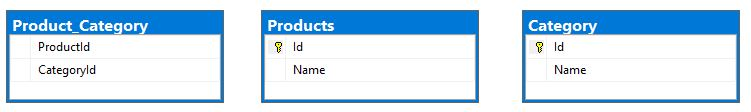

# GeometricFigure
В библиотеке реализованы фигуры круг и треугольник с возможностью проверки является ли треугольник прямоугольным.
#### Пример использования:
    IFigure circle = new Circle(10);
    double area = circle.GetArea();

#### Для добавления нового типа фигур нужно реализовать интерфейс IFigure: 
    public class Square : IFigure {}

---
### Задание 6

---
### Задание 9
### Диаграмма БД

#### SQL запрос:
    SELECT P."Name", C."Name"
    FROM Products P
    LEFT JOIN Product_Category PC
	    ON P.Id = PC.ProductId
    LEFT JOIN Category C
	    ON PC.CategoryId = C.Id;
